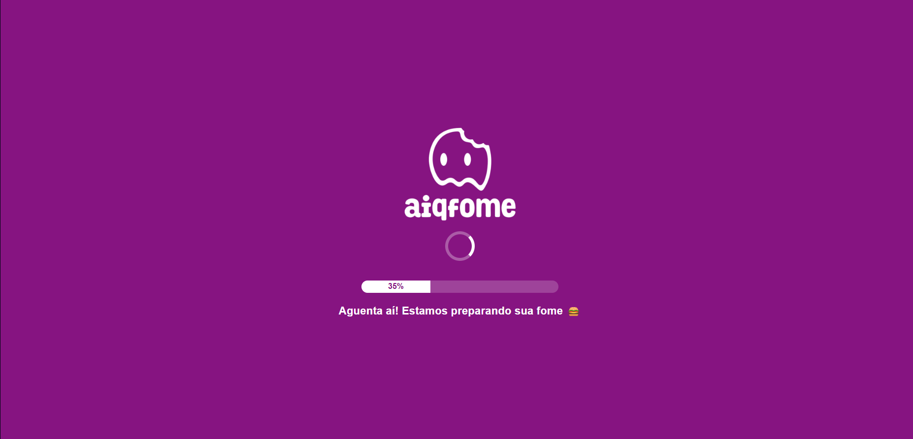
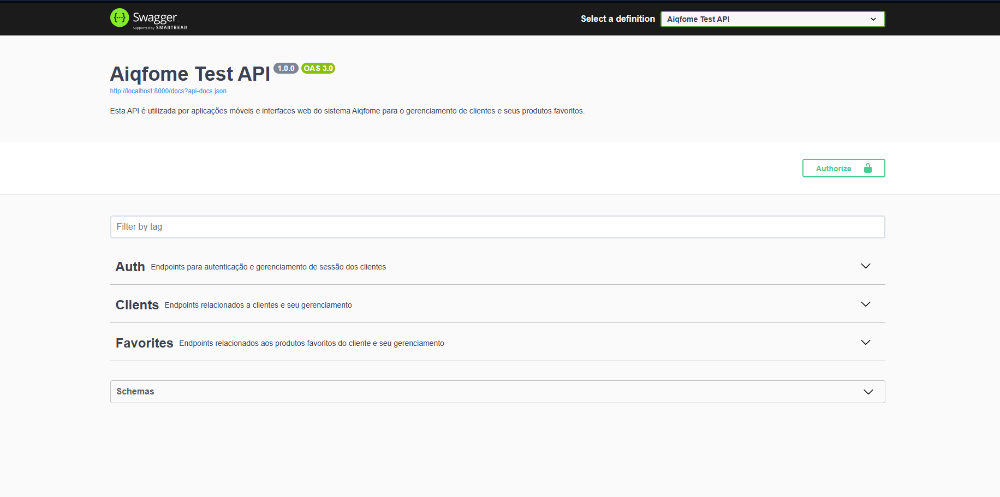
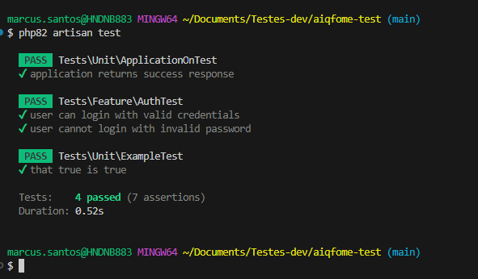

# Aiqfome - API de Produtos Favoritos

API RESTful desenvolvida como parte de um desafio técnico para o Aiqfome, com o objetivo de gerenciar **clientes** e seus **produtos favoritos**, integrando com a API pública [Fake Store API](https://fakestoreapi.com/docs).

---

## Contexto

O Aiqfome está expandindo seus canais de integração e precisa de uma API robusta para gerenciar os "produtos favoritos" de usuários. Esta funcionalidade será utilizada por aplicativos e interfaces web, exigindo alta performance, escalabilidade e integração com APIs externas confiáveis.

---

##  Requisitos Atendidos

- [x] Criar, visualizar, editar e remover clientes
- [x] Garantir unicidade do e-mail
- [x] Associar produtos favoritos aos clientes
- [x] Validar produtos com a API externa (`fakestoreapi.com`)
- [x] Evitar duplicação de produtos favoritos
- [x] Exibir `id`, `title`, `image`, `price` e `rating` do produto
- [x] Autenticação via token JWT
- [x] Arquitetura modular e separada por camadas
- [x] Documentação Swagger
- [x] Docker + PostgreSQL prontos para produção
- [x] Cache implementado para performance

---

## Arquitetura e Decisões Técnicas

- A aplicação foi escrita em **Laravel 12 (PHP 8.2)** por ser o ambiente mais estável no momento da entrega.
- A arquitetura é modular e baseada em **camadas separadas**: DTOs, Mappers, Clients HTTP, Controllers e Middleware.
- A API conta com **sistema de cache** para reduzir chamadas repetidas à API externa.
- Foram escritos **testes automatizados** como demonstração de qualidade e estrutura, embora o ambiente `.env.testing` precise ser configurado.
- A intenção era criar uma versão paralela em **Node.js**, mas optei por focar em uma entrega sólida e bem testada dentro do prazo.

---

---
## Próximos Passos e Melhorias Sugeridas

A aplicação foi pensada com escalabilidade e boas práticas em mente. A seguir estão algumas sugestões para evolução da arquitetura:

-  **Orquestração com Kubernetes**
  Containerizar a aplicação com suporte ao Kubernetes e práticas de CI/CD, permitirá escalar horizontalmente conforme a demanda.
-  **Vault para gerenciamento de segredos**
  A utilização do [HashiCorp Vault](https://www.vaultproject.io/) permitirá injetar credenciais, secrets e tokens sensíveis de forma segura e auditável.
- **Redis como sistema de cache distribuído**
  A troca do cache local por uma instância do Redis permitirá maior eficiência e compatibilidade em ambientes com múltiplas réplicas, além de habilitar features como TTL por item, filas assíncronas e pub/sub para eventos.
- **Autoescalabilidade**
  A configuração de métricas de uso (CPU/RAM) via Horizontal Pod Autoscaler (HPA) no Kubernetes permitirá escalar os pods da API automaticamente de acordo com a carga de trabalho.

- **Monitoramento e observabilidade**
  Ferramentas como Prometheus + Grafana ou Elastic Stack (ELK) podem ser utilizadas para monitorar desempenho, rastrear erros e analisar métricas em tempo real.

- **Mais testes e CI/CD completo**
  Expandir a cobertura de testes (unitários e integração) e configurar pipelines CI/CD com validação automatizada antes do deploy.

- **Rate limiting e proteção contra abuso**
  Implementar controle de requisições por IP ou token com Laravel RateLimiter + Redis, para proteger a API de uso indevido.

```
Essas melhorias visam preparar a aplicação para ambientes de produção de alta escala e uso intensivo.

```
---

## Tecnologias Utilizadas

- Laravel 12
- PHP 8.2
- PostgreSQL
- Docker + Docker Compose
- JWT Auth
- API externa: [https://fakestoreapi.com](https://fakestoreapi.com)

---

##  Autenticação

A API é pública, mas requer autenticação via token JWT.

Exemplo de header:

```
Authorization: Bearer {seu_token_aqui}
```


## 🛠️ Instalação Local

### 1. Clonar e preparar

```bash
git clone https://github.com/engmarcus/aiqfome-test
cd aiqfome-test
cp .env.example .env
```

### 2. Instalar dependências, gerar chave e segredo JWT

```bash
composer install
```
```bash
php artisan key:generate
```
```bash
php artisan jwt:secret
```


### 3. Ajustar o `.env`
Conforme seu ambiente

```env
DB_CONNECTION=pgsql
DB_HOST=127.0.0.1
DB_PORT=5432
DB_DATABASE=aiqfome
DB_USERNAME=seu_usuario
DB_PASSWORD=sua_senha
```

### 4. Preparar o banco de dados

Foi criado um comando personalizado que automatiza a criação do banco, execução das migrações e demais preparações iniciais.

```bash
php artisan app:setup
```

### 5. Iniciar servidor

```bash
php artisan serve
```

Acesse: [http://localhost:8000/api/documentation](http://localhost:8000/api/documentation)

---

##  Rodando com Docker

### Clonar e preparar

```bash
git clone https://github.com/engmarcus/aiqfome-test
cd aiqfome-test
cp .env.docker .env
```

### Build e subida dos containers

```bash
docker compose up --build -d
```

### Acesso à aplicação

Após o build e inicialização dos containers, a aplicação exibirá uma **tela de loading** até que todas as dependências estejam prontas.

[http://localhost:8000](http://localhost:8000)

#### Tela de loading




---

## Documentação (Swagger)

Disponível em:

```
http://localhost:8000/api/documentation
```
#### Tela de Documentação



---

##  Testes (rodando localmente - windows)

Testes foram implementados para validar comportamento da aplicação, porém é necessário configurar variáveis no `.env.testing`.

Rodar os testes:

```bash
php artisan test
```
#### Tela de Testes



---

---

## Possíveis Problemas

- Banco não sobe? Verifique `.env` e se o serviço `db` do Docker está ativo.
- Erro 500? Revise permissões, APP_KEY, JWT_SECRET ou variáveis ausentes.
- Problemas com seed/migration? Confirme permissões de volume ou banco.

---

## Licença

MIT © 2025 — Desenvolvido para o desafio técnico do Aiqfome por [Marcus Vinicius](https://www.linkedin.com/in/engenheiromarcus)
